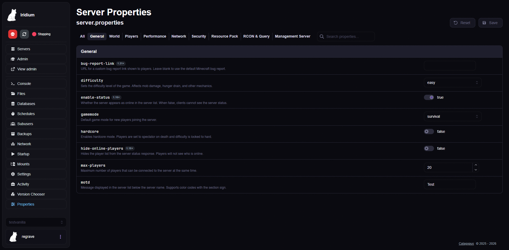
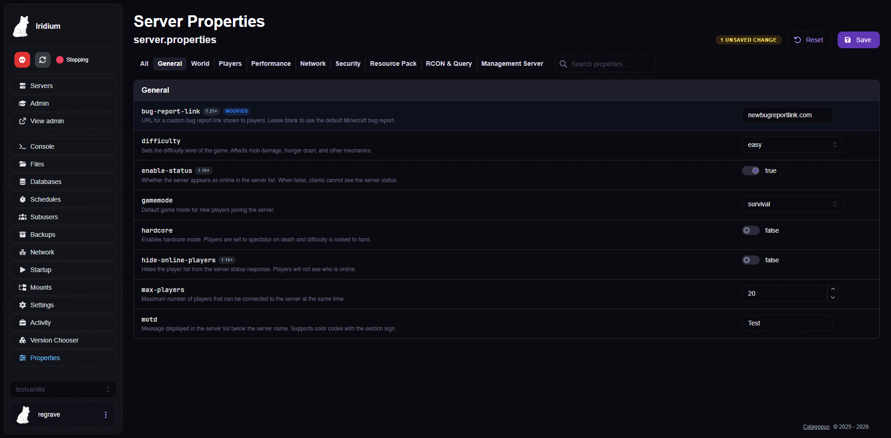

# Server Properties Editor

A [Calagopus Panel](https://github.com/calagopus/panel) extension that provides a visual editor for Minecraft `server.properties` files.

## Screenshots

### Properties Editor
Browse and edit all server properties organized by category with proper input types, descriptions, and version tags.



### Unsaved Changes
Modified values are highlighted and tracked. Save all changes at once with a single click.



## Features

- **Categorized view** - Properties grouped into General, World, Players, Performance, Network, Security, Resource Pack, RCON & Query, and Management Server
- **Smart input types** - Booleans render as toggles, enums as dropdowns, integers as number inputs, view/simulation distance as sliders
- **Descriptions for every property** - Clear explanations of what each setting does
- **Version tags** - Shows which Minecraft version added each property
- **Removed property handling** - Legacy/removed properties still display with warnings if present in the file
- **Search** - Filter properties by name or description
- **Change tracking** - Modified values highlighted with an unsaved changes counter
- **Reset & save** - Reset all changes or save back to the file
- **Unknown property support** - Properties not in the metadata database still show as editable text fields
- **Sensitive field masking** - Passwords (RCON, management server) use masked inputs
- **Comment preservation** - Comments and formatting in the original file are preserved on save

## Architecture

```
├── Metadata.toml          # Extension metadata
├── backend/
│   └── src/lib.rs         # Minimal backend stub (uses panel's built-in file API)
├── frontend/
│   └── src/
│       ├── index.ts       # Extension entry point + route registration
│       ├── properties.ts  # Property metadata database + parser/serializer
│       ├── PropertiesEditorPage.tsx  # Editor UI component
│       └── app.css        # Styling
```

## Property Coverage

Covers all Java Edition `server.properties` fields including:

| Category | Properties |
|----------|-----------|
| General | motd, difficulty, gamemode, hardcore, max-players, enable-status, hide-online-players |
| World | level-name, level-seed, level-type, generate-structures, spawn-protection, max-world-size |
| Players | allow-flight, force-gamemode, player-idle-timeout, op-permission-level, pvp (legacy) |
| Performance | view-distance, simulation-distance, max-tick-time, entity-broadcast-range-percentage |
| Network | server-ip, server-port, online-mode, network-compression-threshold, rate-limit |
| Security | white-list, enforce-whitelist, enforce-secure-profile, prevent-proxy-connections, log-ips |
| Resource Pack | resource-pack, resource-pack-sha1, require-resource-pack, resource-pack-prompt |
| RCON & Query | enable-rcon, rcon.port, rcon.password, enable-query, query.port |
| Management | management-server-enabled, management-server-host/port/secret, TLS settings (1.21.9+) |

Also includes removed/legacy properties (allow-nether, spawn-animals, spawn-monsters, etc.) so older server files display correctly.

## Installation

1. Download the latest `.c7s.zip` from [Releases](https://github.com/Regrave/server-properties-editor/releases)
2. Upload it to your panel's extensions directory
3. Trigger a panel rebuild
4. A "Properties" tab will appear in each server's sidebar

## License

MIT
